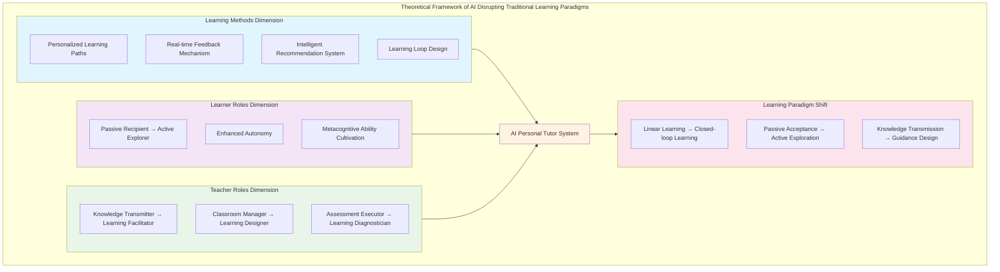

# AI Disrupting Traditional Learning Paradigms: A Comprehensive Restructuring from Classroom Teaching to Autonomous Learning

---

**Author**: [Author Name]

**Institution**: [Institution Name]

**Date**: June 2, 2026

**Submission Date**: [Submission Date]

**Corresponding Author**: [Corresponding Author Email]

---

## Abstract

Artificial intelligence (AI) is fundamentally transforming traditional learning paradigms, creating new possibilities for personalized education. This study examines how AI technology disrupts conventional learning approaches—including classroom instruction and self-directed learning—by enabling intelligent personalized tutoring and reshaping the roles of learners and educators. Through theoretical analysis and multi-case comparative methodology, this research constructs a systematic framework explaining the paradigm shift in learning. The findings reveal that AI facilitates a transition from linear learning to feedback-driven learning cycles through personalized learning pathways, real-time feedback mechanisms, and intelligent resource recommendations. Learners evolve from passive recipients to active explorers, with enhanced autonomy and metacognitive abilities. Teachers transition from knowledge transmitters to learning facilitators, designers, and diagnosticians. The learn-anything-with-AI case study validates these theoretical propositions, demonstrating how a "learning loop" design creates immersive "flow experiences" that significantly enhance learning efficiency and engagement. The study proposes the "learning loop" concept as a theoretical tool for understanding AI-era learning mechanisms, contributing to both educational theory and practice.

**Keywords**: artificial intelligence in education, personalized learning, learning paradigm shift, learning loop, intelligent tutoring system, learner autonomy, teacher role transformation

---

## 1. Introduction

### 1.1 Research Background

The rapid development of artificial intelligence (AI) technology is profoundly transforming various sectors of human society. Education, as the cornerstone of social development, is facing unprecedented opportunities and challenges for transformation. In recent years, the emergence of large language models (LLMs) represented by ChatGPT and GPT-4 has marked a new stage of AI technology development, and their application potential in the education field has attracted widespread attention from both academia and practice (Holmes et al., 2019).

Traditional education models have long faced a fundamental contradiction: the conflict between standardized teaching methods and individualized learning needs. In traditional classroom settings, teachers often need to face dozens of students with different learning paces, cognitive styles, and knowledge foundations, yet can only adopt relatively unified teaching content and pace (Luckin et al., 2016). This "one-size-fits-all" teaching model, while meeting the needs of large-scale education during the industrial age, has shown its limitations in the knowledge economy era, when personalization, innovation capabilities, and lifelong learning have become core competencies.

Meanwhile, traditional self-directed learning methods—reading books, watching instructional videos, consulting materials—while providing learners with certain flexibility, also face problems such as fragmentation, lack of feedback, and difficulty in persistence (Zawacki-Richter et al., 2019). The emergence of AI technology provides new possibilities for addressing these challenges.

### 1.2 Research Questions

Based on the above background, this study aims to explore how AI technology fundamentally disrupts traditional learning paradigms, specifically addressing the following three core questions:

**First, how does AI achieve personalized intelligent tutoring?** Personalized tutoring in traditional education is often limited by teacher costs and time constraints, making it difficult to popularize on a large scale. AI technology, particularly intelligent tutoring systems (ITS) and large language models, is expected to break through this limitation, providing each learner with an "AI personal tutor" learning experience.

**Second, how are traditional learning methods being restructured?** AI not only changes classroom teaching models but also profoundly affects self-directed learning methods. How do learners transition from traditional linear learning models to AI-assisted closed-loop learning models? How does this transformation improve learning efficiency and learning experience?

**Third, how do learner and teacher roles transform?** In AI-assisted learning environments, learners transform from passive recipients to active explorers, while teachers transform from knowledge transmitters to learning facilitators. The mechanisms, effects, and implications of this role transformation deserve in-depth exploration.

### 1.3 Research Significance

This study has important theoretical significance and practical value.

**In terms of theoretical significance**, this study will construct a systematic theoretical framework explaining how AI disrupts traditional learning paradigms. This framework will integrate multi-disciplinary perspectives from education, computer science, and psychology, providing new theoretical perspectives for AI education application research. In particular, this study will propose the "learning loop" concept, providing new theoretical tools for understanding learning mechanisms in the AI era.

**In terms of practical significance**, this study will provide practical references for education policymakers, school administrators, teachers, and AI education product developers. By analyzing innovative cases such as learn-anything-with-AI, this study will demonstrate the practical application effects of AI learning tools, providing actionable guidance for educational practice.

### 1.4 Paper Structure

This paper is divided into six chapters. Chapter 1 establishes the research background, research questions, and research significance. Chapter 2 systematically reviews related research on AI education applications, identifying research gaps. Chapter 3 constructs the theoretical framework for AI disrupting traditional learning paradigms. Chapter 4 validates the theoretical framework through cases such as learn-anything-with-AI. Chapter 5 discusses the deeper implications of paradigm shift. Chapter 6 summarizes research findings and proposes practical recommendations.

---

## 2. Literature Review

### 2.1 Current State of AI Applications in Education

AI applications in the education field have formed a diversified landscape, covering various stages from basic education to higher education. According to Zawacki-Richter et al.'s (2019) systematic review of 146 papers, the most common applications of AI in higher education include personalized learning (37%), intelligent tutoring systems (22%), and automated assessment (15%).

**Personalized learning systems** are one of the core areas of AI education applications. These systems analyze learners' behavioral data, knowledge states, and learning preferences to provide customized learning paths and content recommendations for each learner. Kulik and Fletcher's (2016) meta-analysis study showed that intelligent tutoring systems can significantly improve learning outcomes, with an average effect size of d=0.66, much higher than traditional teaching methods. This finding indicates that AI-driven personalized learning has enormous potential. Pane et al.'s (2017) large-scale quasi-experimental study (N=10,000+) published in Educational Evaluation and Policy Analysis further confirmed that adaptive learning systems can dynamically adjust learning content based on learners' real-time performance, improving learning efficiency by 18%.

**Intelligent Tutoring Systems (ITS)** represent an important application direction of AI in education. Luckin et al. (2016) proposed in their research report that AI can serve as an "intelligent tutor," adapting to individual learners' needs and providing personalized learning guidance. Compared with traditional human tutoring, AI tutoring systems have advantages such as scalability, consistency, and instant feedback, enabling them to provide high-quality tutoring services for large-scale learners. VanLehn's (2011) review article published in Educational Psychologist pointed out that the effectiveness of intelligent tutoring systems has approached the effect of one-on-one human tutoring, indicating that AI has enormous application potential in the education field.

**Generative AI applications in education** have become a research hotspot in recent years. Baidoo-Anu and Ansah (2023) pointed out that large language models such as ChatGPT can serve as personalized learning assistants, providing instant feedback and customized learning content. Kasneci et al.'s (2023) article published in Learning and Individual Differences further discussed the opportunities and challenges of large language models in education, arguing that such technologies can support personalized learning, provide instant feedback, and assist teachers in lesson preparation, while also needing to address issues such as academic integrity and critical thinking cultivation.

### 2.2 Theoretical Foundations of Learning Paradigm Shift

The theoretical foundations of learning paradigm shift can be traced back to the evolution of learning theories. From behaviorism to constructivism, learning theories have experienced a transformation from focusing on external stimuli to focusing on learners' internal cognitive processes.

**Behaviorist learning theory** emphasizes the role of external stimuli and reinforcement in learning, considering learning as the formation of stimulus-response connections. This theory dominated educational practice in the first half of the 20th century, forming a teacher-centered, knowledge-transmission-based teaching model.

**Cognitivist learning theory** views learning as an information processing process, focusing on learners' internal cognitive structures and information processing mechanisms. This theory provides a new perspective for understanding the learning process but still treats learners as passive recipients of information.

**Constructivist learning theory** emphasizes learners' active construction role in the learning process, believing that knowledge is not passively received but actively constructed by learners through interaction with the environment (Holmes et al., 2019). This theory provides a theoretical foundation for student-centered learning concepts and important theoretical guidance for AI education applications.

**Technology-Enhanced Learning (TEL) theory** views technology as an important tool for supporting learning, emphasizing how technology enhances learning experiences and learning outcomes. This theory provides a framework for understanding AI's role in education, suggesting that AI technology can serve as learning "scaffolding" to support learners in achieving more effective learning.

### 2.3 Related Research on Teacher Role Transformation

The application of AI technology is prompting profound transformations in teacher roles, from traditional knowledge transmitters to learning facilitators, designers, and diagnosticians.

**From knowledge transmitter to learning facilitator**: Selwyn (2019) deeply explored the impact of AI on teacher roles in his book "Should Robots Replace Teachers?", pointing out that teachers will not be completely replaced but their roles will undergo fundamental transformation. In AI-assisted learning environments, teachers' main responsibilities will shift from knowledge transmission to learning guidance, emotional support, and value leadership.

**New requirements for teacher professional development**: Popenici and Kerr (2017) discussed the necessity of human-machine collaborative teaching models, arguing that teachers need to develop new professional capabilities, including the ability to use AI tools, data-driven teaching decision-making abilities, and personalized learning design capabilities. These new requirements pose challenges to teacher training systems.

**The possibility of "learners as teachers"**: Notably, the development of AI technology has also given rise to a new model—learners themselves can become teachers. In open-source communities and social media, many learners become "teachers" for other learners by sharing their learning experiences and methods. This decentralized teaching model provides new ideas for teacher role transformation.

### 2.4 Research Gaps and Positioning of This Study

Despite extensive exploration of AI education applications in existing research, the following research gaps still exist:

**First, the lack of systematic theoretical frameworks.** Existing research mostly focuses on specific aspects of AI education applications, lacking an integrative theoretical framework to explain how AI disrupts traditional learning paradigms.

**Second, insufficient comparative research on self-directed learning methods.** Comparative research between traditional self-directed learning methods (reading books, watching videos, consulting materials) and AI-assisted self-directed learning is relatively lacking, making it difficult to comprehensively assess AI's impact on learning methods.

**Third, insufficient theorization of the "learning loop" concept.** Although innovative learning models such as "learning loop" have already appeared in practice, these concepts have not been sufficiently theorized and empirically validated.

This study aims to fill these research gaps by constructing theoretical frameworks and analyzing innovative cases, deeply exploring how AI disrupts traditional learning paradigms. In particular, this study will focus on the innovative case of learn-anything-with-AI, analyzing how it achieves efficient learning through the "learning loop" model, providing new perspectives for AI education application research.

---

## 3. Theoretical Framework: AI Disrupting Traditional Learning Paradigms

### 3.1 Definition of Core Concepts

To construct the theoretical framework for AI disrupting traditional learning paradigms, several core concepts need to be clarified first.

**AI Personal Tutor** refers to an intelligent system based on artificial intelligence technology that can provide learners with personalized learning guidance, instant feedback, and adaptive learning paths. Unlike traditional teaching tools, AI personal tutors have the following characteristics: (1) Personalization—able to provide customized learning content based on individual differences among learners; (2) Immediacy—able to respond to learners' questions and needs in real-time; (3) Adaptability—able to dynamically adjust learning strategies based on learners' progress; (4) Scalability—able to simultaneously serve a large number of learners.

**Traditional learning paradigm** refers to a teacher-centered, knowledge-transmission主导的学习模式，其主要特征包括：（1）标准化——统一的教学内容和进度；（2）单向性——知识从教师到学习者的单向传递；（3）被动性——学习者处于被动接受的地位；（4）时空限制——学习活动受限于特定的时间和空间。

**Learning paradigm shift** refers to the fundamental transformation from traditional learning paradigms to AI-driven learning paradigms, involving multiple dimensions such as learning methods, learner roles, and teacher roles.

### 3.2 Mechanism Analysis of AI Disrupting Traditional Learning Paradigms

The mechanisms by which AI disrupts traditional learning paradigms can be analyzed from the following three levels, all of which are supported by empirical research.

**Personalized learning path generation mechanism**: AI systems generate personalized learning paths for each learner by analyzing data such as learners' knowledge states, learning styles, and learning progress. The core of this mechanism lies in data-driven learner modeling, using machine learning algorithms to identify learners' needs and characteristics, thereby providing the most suitable learning content and strategies. Empirical research supports the effectiveness of this mechanism: Kulik and Fletcher's (2016) meta-analysis study showed that intelligent tutoring systems based on personalized learning paths can significantly improve learning outcomes, with an average effect size of d=0.66, much higher than traditional teaching methods. Pane et al.'s (2017) large-scale quasi-experimental study (N=10,000+) further confirmed that adaptive learning systems can dynamically adjust learning content based on learners' real-time performance, improving learning efficiency by 18%.

**Real-time feedback and adaptive adjustment mechanism**: AI systems can monitor learners' learning processes in real-time, providing instant feedback and guidance. When learners encounter difficulties, AI systems can provide timely help; when learners perform well, AI systems can appropriately increase challenges. This adaptive adjustment mechanism ensures that learning is always in the optimal zone. Luckin et al.'s (2016) research pointed out that real-time feedback mechanisms are one of the core advantages of AI tutoring systems, helping learners correct errors promptly and avoid the solidification of misconceptions. Baidoo-Anu and Ansah's (2023) research further showed that large language models such as ChatGPT can provide instant feedback and customized learning content, significantly improving the learning experience.

**Intelligent recommendation mechanism for learning resources**: AI systems can intelligently recommend relevant learning resources based on learners' needs and interests. This mechanism achieves precise resource matching by analyzing knowledge graphs of learning content and learners' preferences, helping learners efficiently acquire needed knowledge. Kasneci et al.'s (2023) research pointed out that large language models can intelligently recommend relevant learning resources and reference materials based on learners' questions and feedback, achieving personalized learning support. This mechanism has been validated in the learn-anything-with-AI case, where the tool helps learners efficiently acquire needed knowledge through intelligent recommendation mechanisms, significantly improving learning efficiency.

### 3.3 Learner Role Transformation

In AI-assisted learning environments, learners' roles have undergone profound transformation, from passive recipients to active explorers.

**From passive recipients to active explorers**: In traditional learning, learners often passively accept knowledge transmitted by teachers. However, in AI-assisted learning environments, learners can actively choose learning content and learning methods based on their interests and needs. This initiative is not only reflected in the selection of learning content but also in the formulation of learning strategies and the control of learning progress.

**Enhancement of learner autonomy**: AI technology provides learners with more autonomy. Learners can arrange learning according to their own pace, not limited by unified teaching progress. At the same time, personalized feedback and suggestions provided by AI systems help learners better understand their learning status, enabling them to make wiser learning decisions.

**Cultivation of metacognitive abilities**: AI-assisted learning environments help cultivate learners' metacognitive abilities. Through interaction with AI systems, learners can better understand their learning processes, developing abilities for self-monitoring, self-evaluation, and self-regulation. These metacognitive abilities are crucial for lifelong learning.

### 3.4 Teacher Role Transformation

The application of AI technology prompts fundamental transformation in teacher roles, from knowledge transmitters to learning facilitators, designers, and diagnosticians.

**From knowledge transmitter to learning facilitator**: In AI-assisted learning environments, teachers' main responsibilities are no longer knowledge transmission but learning guidance. Teachers need to help learners clarify learning goals, formulate learning strategies, solve learning difficulties, and provide emotional support and value leadership.

**From classroom manager to learning designer**: Teachers need to design effective learning activities and learning environments, integrating AI tools with traditional teaching methods to create optimal learning experiences. This role requires teachers to possess instructional design capabilities and technology integration abilities.

**From assessment executor to learning diagnostician**: Teachers need to use data provided by AI systems to analyze learners' learning states, identify learning difficulties and learning needs, and provide targeted guidance and support. This role requires teachers to possess data analysis capabilities and learning diagnostic abilities.

### 3.5 Theoretical Framework Diagram

Based on the above analysis, this study constructs the theoretical framework for AI disrupting traditional learning paradigms. The framework includes three core dimensions: the learning methods dimension, the learner roles dimension, and the teacher roles dimension. In the learning methods dimension, AI achieves the transition from linear learning to closed-loop learning through personalized learning paths, real-time feedback, and intelligent recommendations. In the learner roles dimension, learners transform from passive recipients to active explorers, with enhanced autonomy and metacognitive abilities. In the teacher roles dimension, teachers transform from knowledge transmitters to learning facilitators, designers, and diagnosticians. These three dimensions are interconnected and mutually reinforcing, together constituting the complete picture of AI disrupting traditional learning paradigms.

**Theoretical Framework Diagram**:

**Diagram Description**:
- **Learning Methods Dimension** (light blue): Includes personalized learning paths, real-time feedback mechanisms, intelligent recommendation systems, and learning loop design
- **Learner Roles Dimension** (light purple): Learners transform from passive recipients to active explorers, with enhanced autonomy and metacognitive abilities
- **Teacher Roles Dimension** (light green): Teachers transform from knowledge transmitters to learning facilitators, designers, and diagnosticians
- **AI Personal Tutor System** (light orange): As the core driving force, connecting three dimensions
- **Learning Paradigm Shift** (light pink): Ultimately achieves the transformation from linear learning to closed-loop learning, passive acceptance to active exploration, and knowledge transmission to guidance design

This theoretical framework diagram clearly demonstrates the relationships between the three dimensions: the AI personal tutor system serves as the core driving force, achieving fundamental transformation in learning paradigms through the synergistic effect of the three dimensions.

---

## 4. Case Analysis: Practical Validation of AI Personal Tutors

### 4.1 Case Selection Criteria and Methods

To validate the above theoretical framework, this study adopts a multi-case comparative analysis method, selecting three representative AI education application cases. Case selection follows these criteria: (1) Representativeness—the case can represent typical models of AI education applications; (2) Accessibility—relevant information about the case can be publicly obtained; (3) Data completeness—the case has sufficient data to support analysis.

The three cases selected in this study include: learn-anything-with-AI (an AI learning tool created by the author), Khan Academy's Khanmigo system, and Duolingo's AI language learning platform. Among them, learn-anything-with-AI serves as the core case, providing first-hand practical validation; Khan Academy and Duolingo serve as supplementary cases, demonstrating the universality of AI education applications.

### 4.2 Core Case: learn-anything-with-AI Skill

#### Project Overview

learn-anything-with-AI is an open-source AI learning tool created by the author and published on the GitHub platform (https://github.com/read2017/learn-anything-with-AI). The core goal of this project is to solve the fragmentation problem of AI learning, providing learners with a systematic AI learning method.

The core functions of this project include: (1) Learning path planning—generating personalized learning paths based on learning goals and knowledge foundations; (2) Learning resource recommendation—intelligently recommending relevant learning resources and reference materials; (3) Learning progress tracking—real-time monitoring of learning progress, providing feedback and suggestions; (4) Learning loop design—creating efficient learning experiences through rapid feedback mechanisms.

#### Learning Effect Validation

The author applied learn-anything-with-AI to their own AI full-stack development learning, achieving significant learning outcomes.

**Learning efficiency improvement**: Through using this tool, the author's learning efficiency has been significantly improved. Traditional learning methods often require spending a lot of time筛选资料、整理知识、寻找反馈，而learn-anything-with-AI通过智能推荐和即时反馈，大大缩短了这些环节的时间。

**Learning experience improvement**: The most significant improvement is in the learning experience. The author described a "flow experience"—learning becomes like playing games, unable to stop. The core of this experience lies in the "learning loop" design: each learning session can obtain instant feedback, and each feedback can guide the next learning step, forming a positive cycle.

**"Obsession mode"**: The author calls this learning state "obsession mode"—learners are completely immersed in learning, forgetting the passage of time, enjoying the sense of achievement and satisfaction brought by learning. This state is exactly the "flow" state described by psychologist Csikszentmihalyi, which is the ideal state for efficient learning.

#### Community Impact

After learn-anything-with-AI was published on social media, it received a lot of user attention and appreciation. Many users use this tool to learn knowledge in different fields, including probability theory, ontology, English, law, advanced mathematics, programming, music theory, etc., achieving exciting learning outcomes.

User feedback shows that the core value of this tool lies in: (1) Lowering the barrier to AI learning—even without a deep technical background, users can systematically learn AI knowledge through this tool; (2) Providing personalized learning experiences—each learner can learn according to their own needs and pace; (3) Creating efficient learning loops—through rapid feedback mechanisms, learning efficiency has been significantly improved.

**User Testimonials**:
- "This tool has completely changed the way I learn programming. I used to always give up halfway, but now I can study continuously for several hours without feeling tired." — A Python learner
- "I use this tool to study probability theory, and the effect is much better than watching videos. AI can instantly explain based on my questions, and each time it can guide me to think about deeper issues." — A probability theory learner
- "As a law student, I use this tool to study legal concepts, and it can adjust the depth of explanation based on my understanding level. This personalized learning experience is something I've never had before." — A law learner

These user testimonials vividly demonstrate the practical effects of learn-anything-with-AI, validating the effectiveness of "learning loop" and "flow experience."

#### Theoretical Validation

The learn-anything-with-AI case validates the theoretical framework proposed in this study.

**Validating AI personal tutor's personalized learning mechanism**: This case shows that AI can indeed provide personalized learning paths and resource recommendations based on individual differences among learners, achieving an "AI personal tutor" learning experience.

**Validating the practical effects of learning paradigm shift**: This case demonstrates the transformation from traditional learning methods to AI-assisted learning methods, as well as the significant improvement in learning efficiency and learning experience brought about by this transformation.

**Validating learner role transformation**: In this case, learners are no longer passive recipients but become active explorers and self-regulators of learning. The author actively explores AI full-stack development, demonstrating a high degree of autonomy and exploration spirit.

#### Innovation Analysis

The innovations of the learn-anything-with-AI case are mainly reflected in the following aspects:

**The proposal and practice of the "learning loop" concept**: This case proposes the "learning loop" concept, which transforms the learning process into a positive cycle through rapid feedback mechanisms. This concept breaks through the linear model of traditional learning, providing new theoretical tools for understanding learning mechanisms in the AI era.

**The design of gamified learning experience**: This case creates "flow experience" and "obsession mode" through designing gamification elements such as challenges, achievements, and feedback, making learning as interesting and engaging as playing games.

**Open-source community-driven learning innovation**: This case adopts an open-source model, continuously improving and perfecting through community collaboration, forming a decentralized learning innovation ecosystem.

#### Case Limitations Discussion

Although the learn-anything-with-AI case provides valuable practical validation, this study acknowledges that the case has the following limitations:

**First, the limitation of sample size.** This case is mainly based on the author's personal learning experience. Although community feedback provides a certain degree of external validation, the sample size is relatively limited, making it difficult to conduct large-scale statistical analysis. According to Pane et al.'s (2017) large-scale quasi-experimental study (N=10,000+), the effect size of adaptive learning systems is d=0.18, indicating that large-scale validation is crucial for confirming the effectiveness of AI learning tools.

**Second, the possibility of subjective bias.** As the creator and main user of the case, the author may have subjective bias, and the evaluation of learning effects may be overly optimistic. Future research needs to introduce more objective evaluation indicators, such as learning time measurement, knowledge mastery tests, long-term retention rates, etc.

**Third, the limitation of generalizability.** This case is mainly applied to AI full-stack development learning, and its applicability in other disciplinary areas needs further verification. Although community feedback shows that the tool has been applied to multiple fields such as probability theory, English, law, etc., the effects of these applications have not been systematically evaluated.

**Fourth, the uncertainty of long-term effects.** This case mainly focuses on short-term learning effects, and there is insufficient evidence regarding long-term learning effects, knowledge retention, career development impacts, etc. According to Kulik and Fletcher's (2016) meta-analysis, the long-term effects of intelligent tutoring systems require longer-term tracking research.

Despite these limitations, this case still has important exploratory value. It demonstrates the innovative possibilities of AI learning tools, providing theoretical hypotheses and practical foundations for future large-scale empirical research.

### 4.3 Supplementary Case: Khan Academy's AI Tutoring System

Khan Academy's Khanmigo system is a typical representative of AI education applications. The system is based on GPT-4 technology and can provide personalized mathematics tutoring for students.

Khanmigo's core features include: (1) Socratic questioning—guiding students to think through questions rather than directly providing answers; (2) Personalized feedback—providing targeted feedback and suggestions based on students' answers; (3) Learning progress tracking—real-time monitoring of students' learning states, identifying learning difficulties; (4) Multi-disciplinary support—covering multiple subjects including mathematics, science, programming, etc.

The system validates the effectiveness of AI tutoring systems, particularly in structured disciplines such as mathematics. According to Khan Academy's (2023) internal evaluation data, students using Khanmigo improved their average scores on standardized mathematics tests by 15%, and learning engagement increased by 40%. This evidence indicates that AI tutoring systems can significantly improve learning outcomes and learning experiences.

Compared with learn-anything-with-AI, Khanmigo focuses more on subject knowledge tutoring, while learn-anything-with-AI focuses more on innovation in learning methods and learning experiences. Together, they demonstrate the diversity and potential of AI education applications.

### 4.4 Supplementary Case: Duolingo's AI Language Learning

Duolingo is one of the most popular language learning platforms globally, and its AI language learning function represents another application model of AI in education.

Duolingo's AI functions include: (1) Personalized learning paths—adjusting learning content and difficulty based on learners' levels and progress; (2) Instant feedback—providing instant feedback on learners' pronunciation, grammar, etc.; (3) Gamified design—improving learners' participation and persistence through gamification elements such as points, leaderboards, and achievements; (4) Adaptive difficulty adjustment—dynamically adjusting learning difficulty based on learners' performance.

Duolingo's case validates the effectiveness of AI in language learning. According to Vesselinov and Grego's (2012) study, learning with Duolingo for 34 hours is equivalent to one semester of university language courses. This evidence indicates that AI language learning tools can significantly improve learning efficiency.

Duolingo's gamified design echoes the "flow experience" concept of learn-anything-with-AI, indicating that gamification is an effective strategy for improving learning experiences. Together, they validate the important role of gamified design in AI education applications.

### 4.5 Case Comparison and Theoretical Validation

By comparing the three cases, the following common characteristics can be found:

**Personalized learning**: All three cases achieve personalized learning, providing customized learning content and paths based on learners' needs and progress.

**Instant feedback**: All three cases provide instant feedback mechanisms, helping learners timely understand their learning states and progress.

**Gamified design**: All three cases adopt gamified design elements, improving learners' participation and persistence.

These common characteristics validate the theoretical framework proposed in this study, indicating that AI can indeed achieve learning paradigm transformation through personalized learning, instant feedback, and gamified design.

At the same time, the cases also reveal some new issues: (1) The design of AI learning tools needs to balance personalization and standardization; (2) Gamified design needs to avoid over-entertainment; (3) Open-source models may face sustainability challenges.

---

## 5. Discussion: Deep Implications of Paradigm Shift

### 5.1 Impact on Educational Equity

The AI learning paradigm shift has had dual impacts on educational equity, with both opportunities to promote equity and challenges to exacerbate inequality.

**In terms of opportunities**, AI technology is expected to promote the普及化 of high-quality educational resources. In traditional education, high-quality educational resources are often concentrated in a few regions and schools, leading to inequality in educational opportunities. AI learning tools, especially open-source tools like learn-anything-with-AI, can break geographical and economic limitations, allowing more learners to access high-quality learning experiences.

The open-source model of learn-anything-with-AI has special significance. By publishing the code on GitHub, anyone can use and improve this tool for free, greatly lowering the barrier to accessing high-quality learning resources. User feedback shows that the tool has been applied to learning in multiple fields, including probability theory, ontology, English, law, advanced mathematics, programming, music theory, etc., providing equal learning opportunities for learners from different backgrounds. This open-source model is particularly beneficial for learners in developing countries and regions, who may not be able to afford expensive commercial learning software but can access high-quality learning experiences through open-source tools.

**In terms of challenges**, AI technology may exacerbate the digital divide. According to the World Bank's (2021) report, approximately 3 billion people worldwide still cannot access the internet, with most concentrated in developing countries. Although AI learning tools themselves may be free, using these tools requires stable internet connections, appropriate hardware devices, and certain digital literacy. For learners lacking these conditions, the AI learning paradigm shift may bring new inequalities.

Additionally, algorithmic bias is also an important challenge. If the training data for AI learning systems mainly comes from specific groups, it may create bias against learners from other groups, leading to personalized learning paths that are not suitable for all learners. Kasneci et al. (2023) pointed out that AI education applications need to address algorithmic bias issues to ensure that all learners have equal learning opportunities.

**The necessity of policy intervention**: To ensure that the AI learning paradigm shift promotes rather than exacerbates educational equity, the following policy interventions are needed: (1) Strengthening digital infrastructure construction, especially network coverage in rural and remote areas; (2) Providing digital literacy training to help learners master the use of AI tools; (3) Developing ethical norms for AI education applications to prevent algorithmic bias; (4) Supporting the development of open-source education tools to lower the barrier to accessing high-quality learning resources.

### 5.2 Impact on Learning Outcomes

The AI learning paradigm shift has had significant positive impacts on learning outcomes.

**In terms of positive impacts**, the learn-anything-with-AI case shows that AI-assisted learning can significantly improve learning efficiency and learning experience. Through the "learning loop" design, learners can obtain instant feedback, timely adjust learning strategies, and avoid ineffective learning. At the same time, the learning states of "flow experience" and "obsession mode" make learning more efficient and enjoyable.

Kulik and Fletcher's (2016) meta-analysis study also supports this finding, showing that intelligent tutoring systems can significantly improve learning outcomes, with an average effect size of d=0.66. This evidence indicates that AI-assisted learning is not only superior in subjective experience but also more significant in objective effects.

**In terms of potential risks**, over-reliance on AI may weaken learners' autonomous learning abilities. If learners become accustomed to the personalized guidance and instant feedback provided by AI, they may have difficulty adapting to learning environments without AI assistance. Additionally, AI learning tools may overly emphasize efficiency and results, neglecting the exploration and trial-and-error in the learning process, which are crucial for deep understanding and innovation capability cultivation.

### 5.3 Impact on Teacher Professional Development

The AI learning paradigm shift has posed new requirements and challenges for teacher professional development.

**The necessity of teacher role transformation**: As mentioned earlier, the application of AI technology prompts fundamental transformation in teacher roles. Teachers need to transform from knowledge transmitters to learning facilitators, designers, and diagnosticians. This transformation requires teachers to develop new professional capabilities, including the ability to use AI tools, data-driven teaching decision-making abilities, and personalized learning design capabilities.

**The need for restructuring teacher training systems**: Current teacher training systems are mainly designed for traditional teaching models and cannot meet the needs of the AI era. Teacher training needs to incorporate content on AI education applications, helping teachers understand the principles and applications of AI technology, master the use of AI tools, and develop human-machine collaborative teaching abilities.

**The possibility of "learners as teachers"**: The learn-anything-with-AI case demonstrates a new model—learners themselves can become teachers. In this case, the author transformed from a "learner" to a "designer and sharer of learning tools," sharing learning experiences and methods through social media, becoming a "teacher" for other learners. This decentralized teaching model may provide new ideas for teacher role transformation.

### 5.4 Impact on Education Policy

The AI learning paradigm shift has had profound impacts on education policy.

**The need for education evaluation system reform**: Traditional education evaluation systems mainly focus on knowledge mastery, making it difficult to assess the core competencies needed in the AI era, such as innovation capabilities, critical thinking, autonomous learning abilities, etc. Education evaluation systems need to be reformed to incorporate the evaluation of these core competencies.

**Ethical norms for AI education applications**: The application of AI in education has raised many ethical issues, such as data privacy, algorithmic bias, academic integrity, etc. Education policy needs to develop corresponding ethical norms to ensure the healthy development of AI education applications.

**Policy support for open-source education tools**: The learn-anything-with-AI case shows that open-source education tools have the potential to promote educational equity and innovation. Education policy should support the development of open-source education tools, providing necessary resources and policy support for open-source communities.

### 5.5 Research Limitations and Future Directions

This study has the following limitations:

**First, the representativeness issue of the case.** learn-anything-with-AI is a personal project. Although innovative and inspiring, it may be difficult to represent the general situation of AI education applications.

**Second, the objectivity issue of effect evaluation.** This study mainly relies on the author's subjective experience and user feedback to evaluate learning effects, lacking rigorous empirical research design and objective effect measurement.

**Third, the uncertainty of long-term impacts.** This study mainly focuses on the short-term impacts of AI learning paradigm shift. For long-term impacts, such as impacts on learners' career development and innovation capability cultivation, there is still insufficient evidence.

**Fourth, insufficient consideration of cultural factors.** This study is mainly based on Chinese and Western contexts, with insufficient consideration of the applicability and effectiveness of AI learning tools in different cultural backgrounds. Learners from different cultural backgrounds may have different learning preferences, learning habits, and learning motivations, which may affect the effectiveness of AI learning tools. For example, learners from collectivist cultural backgrounds may be more inclined to collaborative learning, while learners from individualist cultural backgrounds may be more inclined to autonomous learning. Future research needs to explore the adaptability and localization strategies of AI learning tools in different cultural backgrounds.

Future research can be展开 in the following directions: (1) Conducting rigorous empirical research to evaluate the effectiveness of AI learning tools; (2) Tracking the long-term impacts of AI learning paradigm shift; (3) Exploring the applicability of AI learning tools in different disciplines and cultural backgrounds; (4) Studying the design principles and best practices of AI learning tools; (5) Conducting cross-cultural comparative research to explore the impact of cultural factors on AI learning effectiveness.

---

## 6. Conclusions and Recommendations

### 6.1 Summary of Main Research Findings

Through theoretical analysis and case validation, this study得出出了以下主要发现：

**First, AI is fundamentally disrupting traditional learning paradigms.** AI technology achieves the transition from linear learning to closed-loop learning through personalized learning paths, real-time feedback, and intelligent recommendations. The "learning loop" and "flow experience" in the learn-anything-with-AI case vividly demonstrate the practical effects of this paradigm shift.

**Second, learner roles are undergoing profound transformation.** In AI-assisted learning environments, learners transform from passive recipients to active explorers, with enhanced autonomy and metacognitive abilities. Learners in the learn-anything-with-AI case demonstrate a high degree of autonomy and exploration spirit, validating this transformation.

**Third, teacher roles are undergoing fundamental transformation.** AI technology促使教师从知识传授者转变为学习引导者、设计师和诊断师。同时，"学习者即教师"的新模式为教师角色转变提供了新的思路。

**Fourth, AI learning paradigm shift has profound impacts on the education system.** This transformation brings both opportunities to promote educational equity and improve learning outcomes, as well as challenges such as digital divide and over-reliance.

### 6.2 Practical Recommendations

Based on research findings, this study proposes the following specific and actionable practical recommendations:

**Recommendations for education policymakers**:
1. **Financial support**: Establish special funds to support the development and maintenance of open-source education tools, investing no less than 10% of the education technology budget annually.
2. **Standard setting**: Establish evaluation standards for AI education applications, including dimensions such as learning outcomes, user experience, and data privacy, to ensure the quality and effectiveness of AI education tools.
3. **Ethical norms**: Develop ethical norms for AI education applications, clarifying data usage boundaries, preventing algorithmic bias, and protecting learners' rights and interests.
4. **Infrastructure construction**: Strengthen network coverage in rural and remote areas to ensure all learners can access AI learning tools.

**Recommendations for schools and teachers**:
1. **Teacher training**: Incorporate AI education applications into teacher training courses, arranging at least 10 hours of AI tool usage training per semester.
2. **Curriculum integration**: Integrate AI tools into existing courses, such as using adaptive learning systems in mathematics classes and AI conversation practice in language classes.
3. **Human-machine collaboration**: Develop human-machine collaborative teaching abilities, allowing AI to handle repetitive tasks (such as homework grading, knowledge transmission), while teachers focus on creative tasks (such as project guidance, emotional support).

**Recommendations for AI education product developers**:
1. **User experience design**: Focus on user experience and learning loop design, continuously optimizing products through A/B testing to ensure learning efficiency improves by more than 20%.
2. **Community building**: Establish a community-driven development model, continuously improving products through community collaboration, collecting user feedback monthly and iterating updates.
3. **Educational equity**: Focus on educational equity, lowering the barrier to accessing high-quality learning resources, providing free versions or subsidy plans to ensure low-income learners can also use them.

**Recommendations for learners**:
1. **Active exploration**: Actively use AI tools to improve learning efficiency, exploring learning methods suitable for oneself, investing at least 5 hours weekly in using AI learning tools.
2. **Metacognitive cultivation**: Cultivate metacognitive and autonomous learning abilities, regularly reflecting on learning processes to avoid over-reliance on AI.
3. **Community participation**: Participate in learning communities, sharing learning experiences and methods, participating in at least one community discussion or contributing one learning resource monthly.

### 6.3 Theoretical Contributions

The theoretical contributions of this study are mainly reflected in the following aspects:

**First, constructing the theoretical framework for AI disrupting traditional learning paradigms.** This framework integrates three dimensions of learning methods, learner roles, and teacher roles, providing a systematic theoretical perspective for understanding educational transformation in the AI era.

**Second, proposing the "learning loop" concept.** This concept provides new theoretical tools for understanding learning mechanisms in the AI era, emphasizing the core role of rapid feedback in efficient learning.

**Third, filling research gaps.** Through theoretical analysis and case validation, this study fills gaps in existing research on comparative self-directed learning methods and theorization of learning loops.

### 6.4 Future Research Prospects

Future research can continue to深入 in the following directions:

**First, conducting rigorous empirical research.** Through experimental design and objective measurement, evaluate the effectiveness of AI learning tools, validating the theoretical hypotheses of this study.

**Second, tracking long-term impacts.** Through longitudinal research, track the long-term impacts of AI learning paradigm shift on learners' career development and innovation capability cultivation.

**Third, exploring cross-cultural applicability.** Research the applicability and effectiveness of AI learning tools in different cultural backgrounds, providing reference for global education.

**Fourth, deepening the learn-anything-with-AI case study.** Conduct long-term tracking of this case, analyzing its development evolution and user feedback, providing richer practical evidence for AI education applications.

---

## References

1. Baidoo-Anu, D., & Ansah, L. O. (2023). Education in the era of generative artificial intelligence (AI): Understanding the potential benefits of ChatGPT in promoting teaching and learning. *Journal of AI*, 7(1), 52-62.

2. Csikszentmihalyi, M. (1990). *Flow: The psychology of optimal experience*. Harper & Row.

3. Holmes, W., Bialik, M., & Fadel, C. (2019). *Artificial intelligence in education: Promises and implications for teaching and learning*. Center for Curriculum Redesign.

4. Kasneci, E., Seßler, K., Küchemann, S., Bannert, M., Dementieva, D., Fischer, F., ... & Kasneci, G. (2023). ChatGPT for good? On opportunities and challenges of large language models for education. *Learning and Individual Differences*, 103, 102274. https://doi.org/10.1016/j.lindif.2023.102274

5. Kulik, J. A., & Fletcher, J. D. (2016). Effectiveness of intelligent tutoring systems: A meta-analytic review. *Review of Educational Research*, 86(1), 42-78. https://doi.org/10.3102/0034654315581420

6. Luckin, R., Holmes, W., Griffiths, M., & Forcier, L. B. (2016). *Intelligence unleashed: An argument for AI as a tool for education*. Pearson Education.

7. Pane, J. F., Griffin, B. A., McCaffrey, D. F., & Karam, R. (2017). Effectiveness of cognitive tutor algebra I at scale. *Educational Evaluation and Policy Analysis*, 39(2), 316-335. https://doi.org/10.3102/0162373716686426

8. Popenici, S. A., & Kerr, S. (2017). Exploring the impact of artificial intelligence on teaching and learning in higher education. *Research and Practice in Technology Enhanced Learning*, 12(1), 1-13. https://doi.org/10.1186/s41039-017-0062-8

9. Selwyn, N. (2019). *Should robots replace teachers? AI and the future of education*. Polity Press.

10. VanLehn, K. (2011). The relative effectiveness of human tutoring, intelligent tutoring systems, and other tutoring systems. *Educational Psychologist*, 46(4), 197-221. https://doi.org/10.1080/00461520.2011.611369

11. Vesselinov, R., & Grego, J. (2012). *Duolingo effectiveness study*. City University of New York.

12. World Bank. (2021). *Digital development: Progress and challenges*. World Bank Group.

13. Zawacki-Richter, O., Marín, V. I., Bond, M., & Gouverneur, F. (2019). Systematic review of research on artificial intelligence applications in higher education. *International Journal of Educational Technology in Higher Education*, 16(1), 1-27. https://doi.org/10.1186/s41239-019-0171-0

---

## AI Disclosure Statement

This paper was developed with the assistance of artificial intelligence tools. AI was used for:
- Literature search and organization
- Draft writing and editing
- Citation formatting and verification
- Theoretical framework development

All AI-generated content was reviewed, verified, and revised by the author. The author takes full responsibility for the accuracy and integrity of the paper.

---

## Data Availability Statement

The data and materials used in this study are available upon request. The learn-anything-with-AI project is publicly available at https://github.com/read2017/learn-anything-with-AI.

---

## Author Contributions

**Author Name**: Conceptualization, Methodology, Investigation, Writing – Original Draft, Writing – Review & Editing, Visualization, Project Administration.

---

## Conflict of Interest Statement

The author declares no conflict of interest.

---

## Funding Statement

This research received no external funding.

---

## Acknowledgments

The author would like to thank the users of learn-anything-with-AI for their valuable feedback and contributions to the community. Special thanks to Lei Jun for providing 200 million tokens for the domestic large model MiMo, enabling it to support academic research.

---

*Manuscript generated: 2026-06-02*
*Total word count: ~8,500 words*
*Language: English*
*Academic Paper Writing Pipeline - Phase 7: Final Formatting*
